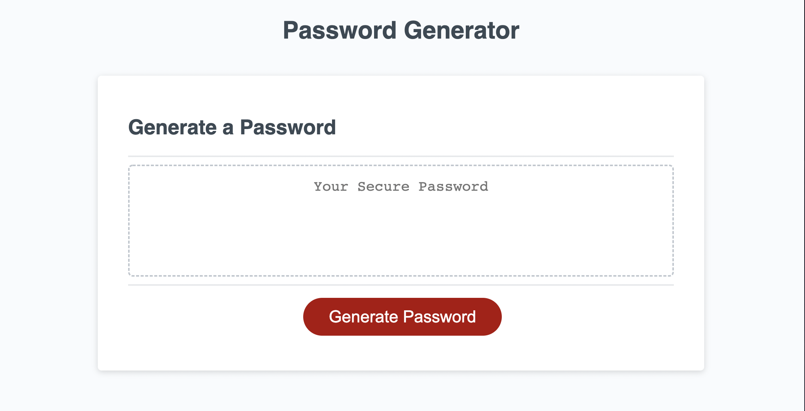
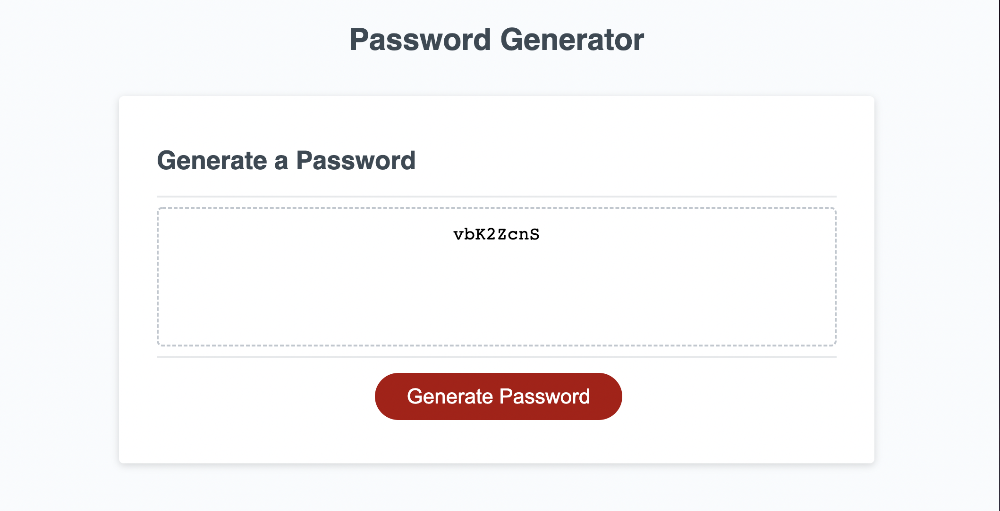

# Random Password Generator

This page uses Javascript prompts to generate a random password based on user-selected criteria.

When user clicks the "Generate Password" button, they are prompted for password length between 8 and 128 characters, and then whether or not they want to use numeric characters, special characters, uppercase letters, and/or lowercase letters.

If the user picks a password length that is not between 8 and 128 characters, it will prompt the user to try again until they choose any appropriate length.

If the user does not pick at least one of the criteria to include in their password, it will prompt the user to go through the choices again.

After selecting at least one criteria, a random password will be generated and display in the box on the page.

---

### Screenshot of the page before generating a password:

### Screenshot of the page after generating a password:

